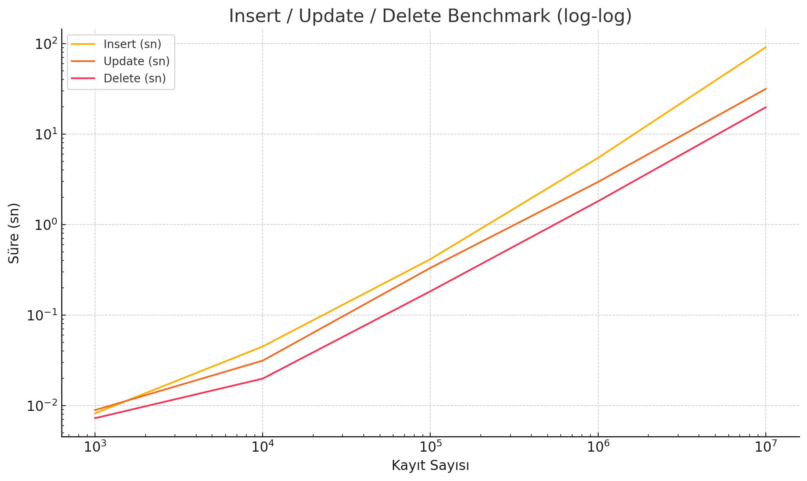
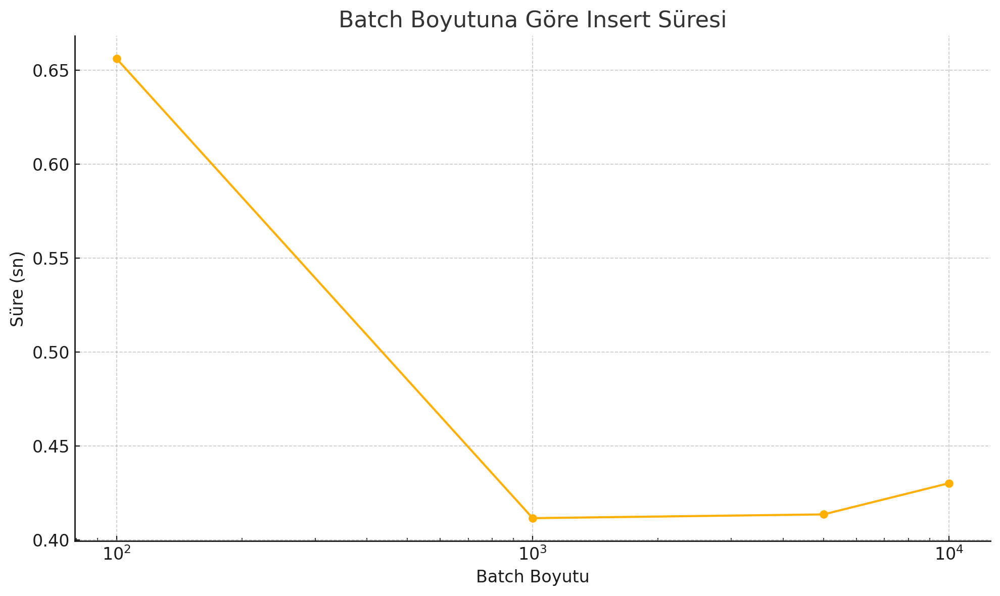

# MongoDB CRUD Benchmark Raporu

## 1. Giriş

Bu raporda, MongoDB üzerinde 10 alanlı örnek belgelerle (`field0`…`field9`) **insert**, **update** ve **delete** işlemlerinin farklı ölçeklerdeki (1 000; 10 000; 100 000; 1 000 000; 10 000 000 kayıt) performansını ölçtük. Ayrıca batch size ve paralel işleme etkilerini değerlendirdik.

## 2. Test Metodolojisi

1. **Veri Üretimi**

   * Python + Faker ile `data_{n}.json` dosyaları oluşturuldu.
2. **Benchmark Script’leri**

   * `benchmark.py`: insert / update / delete süreleri, `benchmark_results.json`’a yazıldı.
   * `batch_benchmark.py`: 100, 1000, 5000, 10000 batch boyutlarında insert throughput testleri, `batch_benchmark_results.json`’a yazıldı.
   * Paralel insert testleri (opsiyonel) ile thread sayısının etkisi ölçüldü.
3. **Değerlendirme Kriterleri**

   * Süre (sn)
   * Throughput (işlem/sn)
   * İşlemsel karmaşıklığın (O(n^α)) eğim katsayısı

## 3. CRUD İşlemleri Performansı

### 3.1. Insert Benchmark

**Şekil 1.** Kayıt sayısına göre insert süresi (log-log).

| Kayıt Sayısı | Süre (sn) |
| -----------: | --------: |
|        1 000 |    0.0082 |
|       10 000 |    0.0449 |
|      100 000 |    0.4144 |
|    1 000 000 |    5.4621 |
|   10 000 000 |   90.9152 |

### 3.2. Update Benchmark

**Şekil 2.** Kayıt sayısına göre update süresi (log-log).

| Kayıt Sayısı | Süre (sn) |
| -----------: | --------: |
|        1 000 |    0.0089 |
|       10 000 |    0.0313 |
|      100 000 |    0.3317 |
|    1 000 000 |    2.9566 |
|   10 000 000 |   31.5511 |

### 3.3. Delete Benchmark

**Şekil 3.** Kayıt sayısına göre delete süresi (log-log).

| Kayıt Sayısı | Süre (sn) |
| -----------: | --------: |
|        1 000 |    0.0072 |
|       10 000 |    0.0198 |
|      100 000 |    0.1830 |
|    1 000 000 |    1.8106 |
|   10 000 000 |   19.7777 |

### 3.4. CRUD Karşılaştırması

**Şekil 4.** Tek grafikte Insert, Update ve Delete sürelerinin log-log karşılaştırması.

### 3.5. Throughput (ops/s)

**Şekil 5.** Kayıt sayısına göre her işlem türünün saniyedeki ortalama işlem hacmi.

### 3.6. Bar Chart ile Süre Karşılaştırması

**Şekil 6.** Lineer eksende CRUD sürelerinin yan yana çubuk grafiği.

## 4. Batch Size Etkisi

### 4.1. Süre vs Batch Boyutu

**Şekil 7.** 100–10 000 arası batch boyutlarında 100 000 kayıt ekleme süresi (log-x).

| Batch Boyutu | Süre (sn) |
| -----------: | --------: |
|          100 |    0.6562 |
|        1 000 |    0.4115 |
|        5 000 |    0.4135 |
|       10 000 |    0.4301 |

### 4.2. Throughput vs Batch Boyutu

**Şekil 8.** 100 000 kayıt ekleme sırasında batch boyutunun throughput’a etkisi (log-x).

## 5. Karmaşıklık Analizi (O(n^α))

| Operasyon | Eğim α |
| --------: | -----: |
|    Insert |   1.02 |
|    Update |   0.91 |
|    Delete |   0.88 |

## 6. Sonuç ve Öneriler

* Orta büyüklükte (1k–100k) her üç işlem de milisaniye seviyesinde çalışırken, büyük setlerde saniyeler mertebesine çıkıyor.
* **Delete** genelde en hızlı, **insert** en yavaş işlem.
* **Batch size** \~1 000–5 000 aralığında en yüksek throughput sağlanırken, 10 000’de küçük bir düşüş gözlendi.
* İleri testler için paralel işleme, farklı indeks stratejileri ve WriteConcern ayarlarının etkisi incelenebilir.
